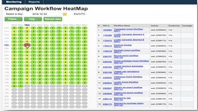
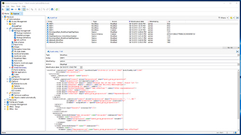
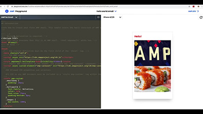

# Självstudiekurser om Adobe Campaign Classic – översikt

Adobe Campaign erbjuder en plattform för att utforma kundupplevelser över flera kanaler och levererar en miljö för visuell kampanjorkestrering, interaktionshantering i realtid och körning över flera kanaler. Den här användarhandboken innehåller videor och självstudiekurser om de många funktioner och möjligheter som finns i Adobe Campaign Classic.

## Nyheter

* **[Komma igång med push-meddelanden för Android](/help/tutorial-getting-started-with-push-notifications-for-android/introduction.md)**

   *I den här självstudiekursen får du hjälp med att skicka push-meddelanden från Adobe Campaign till en Android-app.*

* **[Delegera underdomäner med CNAME (beta)](/help/control-panel-tutorials/subdomains-and-certificates/delegating-subdomains-using-cname.md)**

   *Lär dig hur du konfigurerar och lämnar in en underdomän med CNAME:er i kontrollpanelen.*

* **[Övervaka databaser](/help/control-panel-tutorials/performance-monitoring/monitoring-databases.md)**

   *Läs om hur du övervakar databasanvändningen på dina instanser.*

## Personalens val

<table>
<tr>
  <td>
    
    

      <a href="./monitoring-campaign-classic/workflow-heatmap.md">
    <strong>Färgdiagram över arbetsflöde</strong>
    </a>
    

    

    <em>Få en översikt över antalet samtidiga arbetsflöden.</em>
    

  </td>
   <td>
    
    

      <a href="./monitoring-campaign-classic/audit-trail.md">
    <strong>Granskningsspår</strong>
    </a>
    
 
    

    <em>Registrerar en omfattande lista över åtgärder och händelser som inträffar i Adobe Campaign i realtid.</em>
    

  </td>
  <td>
    
    

      <a href="./sending-messages/email-channel/defining-interactive-email-content-with-amp.md">
    <strong>Definiera interaktivt e-postinnehåll med AMP</strong>
    </a>
    

    

    <em>Lär om hur du aktiverar och använder AMP i Adobe Campaign Classic </em>
    

  </td>
</tr>
</table>

## Ytterligare resurser

* [Dokumentation](https://docs.adobe.com/content/help/sv-SE/campaign-classic/using/getting-started/starting-with-adobe-campaign/about-adobe-campaign-classic.html)
